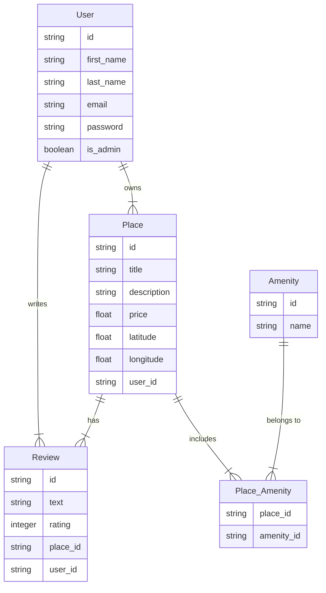

```mermaid
erDiagram
    User {
        string id
        string first_name
        string last_name
        string email
        string password
        boolean is_admin
    }

    Place {
        string id
        string title
        string description
        float price
        float latitude
        float longitude
        string user_id
    }

    Review {
        string id
        string text
        integer rating
        string place_id
        string user_id
    }

    Amenity {
        string id
        string name
    }

    Place_Amenity {
        string place_id
        string amenity_id
    }

    User ||--|{ Place : "owns"
    User ||--|{ Review : "writes"
    Place ||--|{ Review : "has"
    Place ||--|{ Place_Amenity : "includes"
    Amenity ||--|{ Place_Amenity : "belongs to"
```