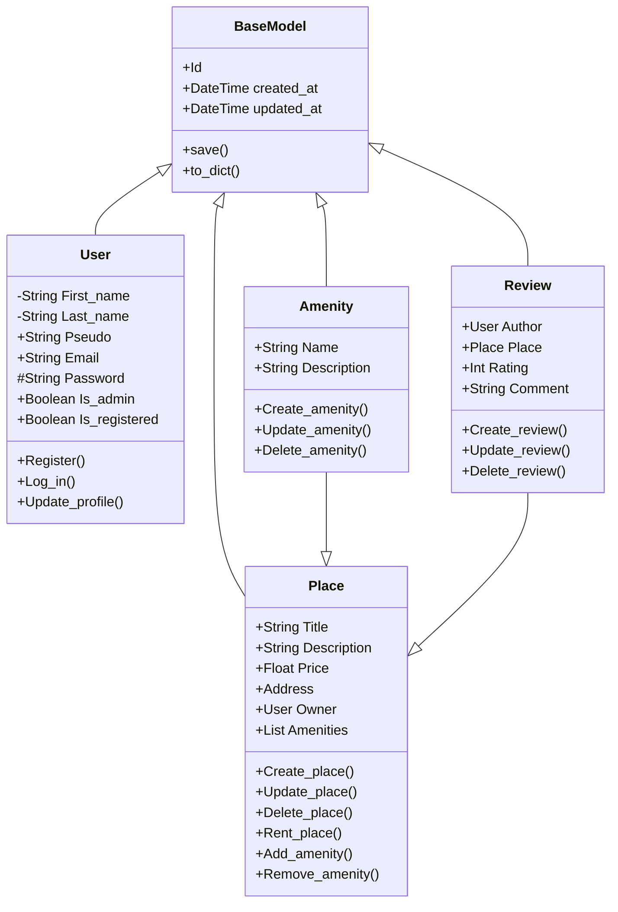

## BaseModel
The BaseModel class is used as a base class to define data models.

## User
The User class represent an user of the HBnB.
It has attributes that defines his ID.
It has methods to check if User is registered, if he wants to log in or sign in, or updating the profile.

## Place
The Place class represents a place to rent.
It has attributes that describe the place.
It has methods to create, update a place, add amenities or remove amenities, and to rent it.

## Review
The Review class represents a review about a place.
It has attributes for the authors, the rating and to comment.
It has methods to create, update or delete a comment.

## Amenity
The Amenity class represents the amenities of a place.
It has attributes for name and description of the amenities.
It has methods to create, update or delete an amenity.