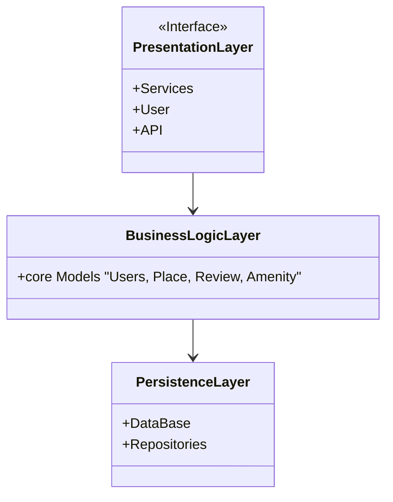

## Presentation Layer:

This layer is responsible for interacting with users via services and APIs.
It includes:
#### API Layer:
Exposes the various endpoints for user interactions like registering, creating places, submitting reviews, etc.

#### Service Layer:
Contains the logic for processing incoming requests and invoking the necessary business logic.

## Business Logic Layer:

This layer contains the core models and business logic of the application.
It includes:
#### User:
Handles user-specific operations such as registration, profile updates, and identification (admin or regular user).

#### Place:
Manages places listed by users, including creating, updating, and retrieving places.

#### Review:
Allows users to add reviews for places, update them, and list them by place.

#### Amenity:
Manages the amenities that are associated with places.

## Persistence Layer:

This layer is responsible for interacting with the database and performing CRUD (Create, Read, Update, Delete) operations.
It includes:
#### Repositories:
For each entity (User, Place, Review, Amenity), there will be a corresponding repository responsible for database operations.

## Facade Pattern:

The Facade Pattern is used to provide a simplified interface to the Presentation Layer. This pattern hides the complexities of the Business Logic and Persistence layers, ensuring that communication between the layers is straightforward.

A Facade Service acts as an intermediary between the Presentation Layer and the Business Logic Layer, and it delegates the calls to the appropriate service classes (e.g., User Service, Place Service, etc.).

## High-Level Package Diagram

## Explanation of the Diagram:
#### Presentation Layer:

This layer interacts directly with the Business Logic layer (by the intermediate of the Facade but we'll talk about it later). It has in it, the various services the Users can access and send request to the Business Logic Layer.

#### Business Logic Layer:

This contains the core models like User, Place, Review, and Amenity. These models contain the logic and behavior of the application entities. It interacts directly with the PersistenceLayer.
Each entity (User, Place, Review, Amenity) has a corresponding repository that interacts with the database for CRUD operations.

#### Persistence Layer
This contains the database that can access objects or repositories. 
