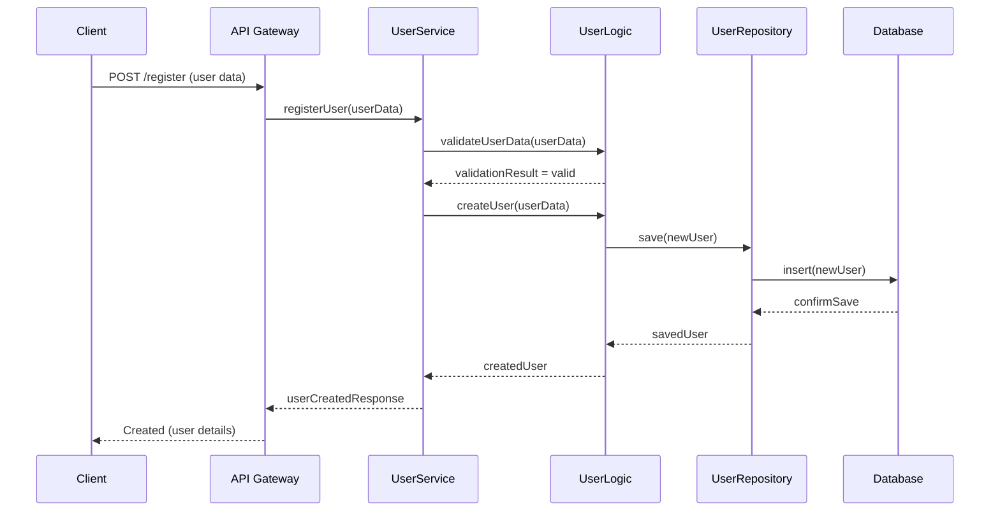
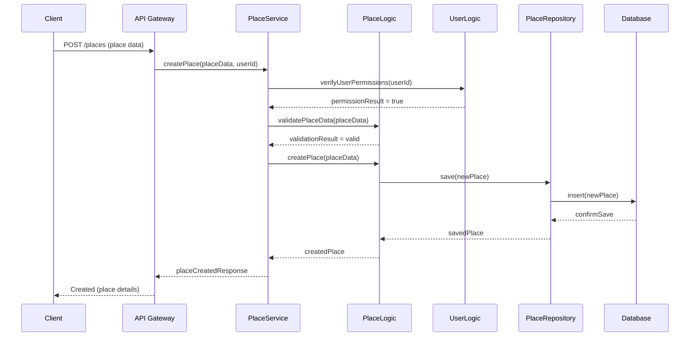
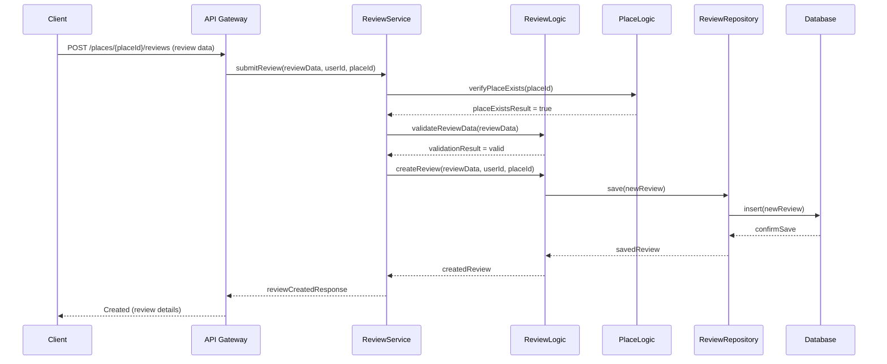
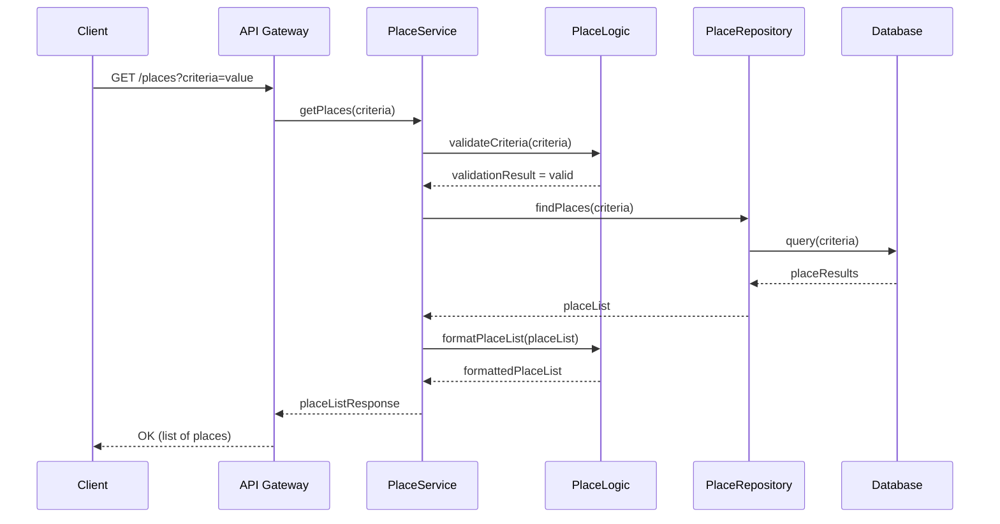

# User Registration

## Place Creation

## Review Submission

## Fetching a List of Places

## User Registration
This sequence diagram illustrates the process of successful user registration in the HBnB application.

#### Key steps:

Client sends registration data to API Gateway

UserService validates user data

UserLogic creates new user

UserRepository saves user to database

Confirmation sent back to client

The Presentation Layer (API Gateway) receives the initial request and delegates to the Business Logic Layer (UserService, UserLogic) for validation and user creation. The Persistence Layer (UserRepository, Database) handles data storage. This flow ensures proper validation and secure storage of new user data.

## Place Creation
This diagram shows the successful creation of a new place listing.

#### Key steps:

Client sends place data to API Gateway

PlaceService verifies user permissions

PlaceLogic validates place data and creates new place

PlaceRepository saves place to database

Confirmation sent back to client

The Presentation Layer initiates the process, while the Business Logic Layer handles permission checks, data validation, and place creation. The Persistence Layer manages data storage. This flow ensures only authorized users can create valid place listings.

## Review Submission
This sequence illustrates the successful submission of a review for a place.

#### Key steps:

Client sends review data to API Gateway

ReviewService verifies place exists

ReviewLogic validates review data and creates new review

ReviewRepository saves review to database

Confirmation sent back to client

The Presentation Layer receives the review submission, the Business Logic Layer verifies the place and validates the review, and the Persistence Layer stores the new review. This process ensures reviews are only submitted for existing places and contain valid data.

## Fetching a List of Places
This diagram depicts the successful retrieval of a list of places based on specified criteria.

#### Key steps:

Client requests places with criteria

PlaceService validates criteria

PlaceRepository queries database for matching places

PlaceLogic formats place list

Formatted list sent back to client

The Presentation Layer receives the initial request, the Business Logic Layer validates the search criteria and formats the results, while the Persistence Layer performs the database query. This flow ensures efficient and accurate retrieval of place listings based on user-specified criteria.